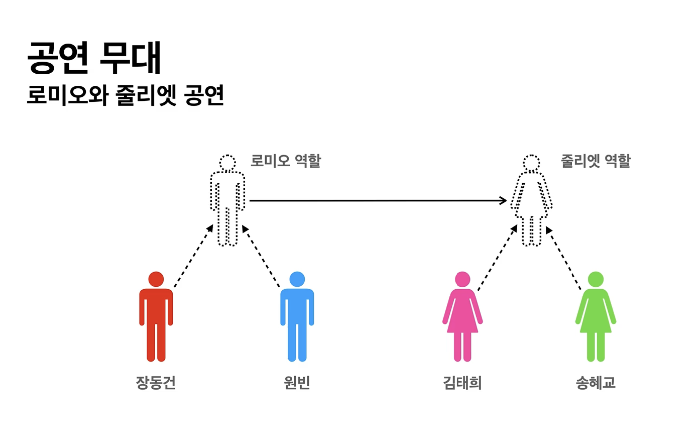

# 스프링 핵심 원리-기본편

객체 지향의 원리와 스프링을 결합해 문제 해결!

스프링을 왜 만들었고 왜 사용하는지 등등 이유 알려줌

- **객체 지향 설계와 스프링**
    - 자바의 추운 겨울과 스프링의 탄생
        - 자바의 표준 기술 EJB(Enterprice Java Beans)
            - 트랜젝션 기술, 분산 기술 등의 고급 기술이 지원 잘 됨
            - 이론적인 부분이 굉장히 지원이 잘 됨
            - 하지만 비쌈, 어려움, 느림, 복잡함 등등 단점이 많음
        - EJB 단점 극복 위해 스프링, 하이버네이트 탄생
            - 하이버네이트 → JPA 가 됨 - 실용성, 안정감 다 잡음
        - 스프링의 역사
            - 2002년 로드존슨 → EJB의 문제를 까는 책을 출간
                - EJB 없이 쓸 수 있는 예제코드 → 스프링의 기본 원리
    - 스프링이란?
        - 여러 기술들의 모음 - 프레임워크, 부트, 데이터, 세션, 시큐리티 등
        - 스프링 프레임워크
            - 핵심 기술 : 스프링 DI 컨테이너, AOP
            - 웹 기술: 스프링 MVC, 스프링 WebFlux
            - 데이터 접근 기술: 트랜잭션, JDBC, ORM 지원, XML 지원
            - 기술 통합: 캐시, 이메일, 원격접근, 스케줄링
            - 테스트: 스프링 기반 테스트 지원
            - 언어: 코틀린, 그루비
            - 최근에는 스프링 부트를 통해서 스프링 프레임워크의 기술들을 편리하게 사용
        - 스프링 부트
            - 스프링을 편리하게 사용할 수 있도록 지원, 최근에는 기본으로 사용
            - 단독으로 실행할 수 있는 스프링 애플리케이션을 쉽게 생성
            - Tomcat 같은 웹 서버를 내장해서 별도의 웹 서버를 설치하지 않아도 됨
            - 손쉬운 빌드 구성을 위한 starter 종속성 제공
            - 스프링과 3rd party(외부) 라이브러리 자동 구성
            - 메트릭, 상태 확인, 외부 구성 같은 프로덕션 준비 기능 제공
            - 관례에 의한 간결한 설정
            - 기본적으로 스프링 프레임워크 위에 써서 도와주는 기술
        - 단어가 문맥에 따라 조금 다르게 사용됨
            - DI 컨테이너 기술, 프레임워크, 부트등을 모두 포함한 생태계
        - 스프링의 핵심 개념, 컨셉
            - 자바 언어 기반의 프레임워크
            - 자바의 특징 - 객체 지향 언어
            - → 좋은 객체 지향 어플리케이션을 개발 할 수 있게 도와줌
    - 좋은 객체 지향이란?
        - 다형성이 있어야 함
            - 역할과, 구현을 나누면 변경하고도 잘 작동 가능 / ex) 로미오, 줄리엣, 연기자
            
            
            
            - 역할과 구현으로 나누면 단순, 유연해짐 세상이
            - CLI는 구현대상의 역할만 알아도 됨, 구현 대상이 얼마나 바껴도 상관 X
            
            → 언어에도 이걸 차용
            
            - 역할 : 인터페이스, 구현 : 구현한 클래스, 객체
                - “인터페이스가 먼저 와야 함”
        - 자바는 오버라이딩으로 다형성 형성 - 입문 때 멤버 레포지토리로 했던 것 처럼
        - 유연, 변경 용이, 확장 가능한 설계 → 인터페이스 안정적 설계가 중요
            - 인터페이스가 변하면, 클라이언트/서버 모두 굉장한 변화가 생겨버림
        - 스프링의 IoC, DI 모두 다형성을 지원하는 기능임
    - 좋은 객체 지향 설계의 5가지 원칙 (SOLID)
        
        로버트 마틴씨가 정리 함
        
        - SRP: 단일 책임 원칙(single responsibility principle)
            - 한 클래스는 하나의 책임만 가져야 한다.
            - 하나의 책임이 모호함, 문맥과 상황에 따라 다름
            - 변경이 있을 때 파급이 적음 → 잘 따름
        - OCP: 개방-폐쇄 원칙 (Open/closed principle)
            - 확장에는 열려있고, 변경에는 닫혀있어야 함
            - 다형성을 활용해야 함 → 역할과 구현의 분리
            - 우리가 전에 했던 것에서는 멤버 서비스 안에서 레포지토리 코드를 바꿨음
                
                → 다형성을 사용했지만, OCP는 못지킴
                
                → 객체를 생성하고, 연관관계를 맺어주는 별도의 조립, 설정자가 필요
                
                → 그걸 스프링 컨테이너가 해줌
                
        - LSP: 리스코프 치환 원칙 (Liskov substitution principle)
            - 구현은 인터페이스의 규약을 지켜야 함
            - ex) 엑셀은 앞으로 가야하고, 뒤로 가면 안 됨.
                
                → 설령 뒤로가게 하더라도 에러는 안 나지만 이건 LSP를 위배한 것임
                
        - ISP: 인터페이스 분리 원칙 (Interface segregation principle)
            - 특정한 인터페이스 하나 > 범용 인터페이스 하나
                
                → 인터페이스가 명확해지고 대체 가능해짐 (잘 적당히 쪼개는게 중요하다)
                
        - DIP: 의존관계 역전 원칙 (Dependency inversion principle)
            - “추상화에 의존해야지 구체화에 의존하면 안 된다.”
            - 서비스가 구현 말고, 인터페이스에 의존해야 한다
            - 입문 때 했던 멤버 서비스도 인터페이스와 구현체에도 의존 함 (DIP 위반)
            
            *의존이란? 그 코드를 알고 있다.
            
        - 다형성 만으로는 뭔가 5%정도 부족함. (OCP, DIP 못지킴)
    - 객체 지향 설계와 스프링
        - 스프링은 DI 컨테이너로 다형성 + OCP,DIP 가능하게 지원
        - 모든 설계에 역할과 구현을 분리해야함, 모든 설계에 인터페이스 있는게 이상적
            
            → 그러나 추상화하면 더 복잡해질 수 있음
            
            → 확장 가능성이 없으면 첨에는 구체 클래스를 직접 사용하고, 꼭 필요할때 리팩터링
            
- **스프링 핵심원리 이해 1 - 예제 만들기**
    
    **프로젝트 생성 (순수한 자바를 쓸거긴 함)**
    
    스프링 부트 사용해서 hello.core 프로젝트 생성
    
    이번엔 딱히 쓸게 없어서 별로 세팅할게 없음
    
    **비즈니스 요구사항과 설계**
    
     **요구사항**
    
    회원
    
    - 가입 조회 가능
    - 일반, vip 두가지 등급 있음
    - 자체 DB 쓸 수도 있고, 외부 시스템과 연동할 수 있음 (미확정) → 인터페이스와 구현 사용
    
    주문과 할인 정책
    
    - 회원은 상품 주문 가능
    - 등급에 따라 할인 정책 적용
    - 모든 vip는 1000원 할인하는 고정금액 할인 ( 나중에 변경 가능 )
    - 할인 정책은 변경 가능성이 높음 (미확정) → 역할과 구현 구분
    
    회원데이터 및 할인 정책이 결정하기 어려운 부분 (무기한 연기도 못함)
    
    → 객체지향 설계, 인터페이스를 만들고 구현을 갈아끼울 수 있도록 설계
    
    *순수한 자바로만 구현 할 것임 (스프링 X)
    
    **회원 도메인 설계**
    
    요구사항
    
    - 회원은 가입하고 조회 가능
    - 일반, vip 두 등급
    - 자체 db, 외부 시스템 (미확정)
    
    **회원 도메인 협력 관계**
    
     클라이언트 → 회원 서비스(가입,조회) → 회원 저장소(인터페이스) (구현 : 메모리,DB,외부)
    
     메모리는 개발용 (정해진게 없으니깐)
    
    **회원 클래스 다이어그램**
    
     <interface> MemberService ← MemberServiceImpl → <interface>MemberRepository
    
    요런 식으로 개발
    
    **회원 객체 다이어그램(실제 객체 간의 참조흐름)**
    
     클라이언트 → 회원서비스(MemberServiceImpl) → 메모리 회원 저장소
    
    **회원 도메인 개발**
    
    멤버, 멤버서비스, 멤버 저장소 구현 (간단하게 getter,setter 정도)
    
    HashMap은 Concurrent 해쉬맵 쓰는게 맞지만 예제니깐 간단하게 해쉬맵 씀(동시성 이슈)
    
    **실행 & 테스트**
    
    1. MemberApp 만들어서 테스트 해봄
        
        new member, find member 만들어서 한번 비교해 봄 (순수한 자바로만)
        
    2. junit 이용해서 테스트 ← **필수임(테스트 코드 작성)**
        
        test 파일에 테스트 클래스 만들어서
        
        import org.junit.jupiter.api.Test; 하고 테스트 해봄(given, when, then)
        
        Assertion .core꺼 써서 assertThat isEqualTo … 해서 비교
        
    
    **회원 도메인 설계의 문제점**
    
    - 다른 저장소로 변경할 때 OCP원칙 준수하나?
    - DIP 잘 지키고 있나? (위반중)
    - 의존관계가 인터페이스 뿐만 아니라 구현체까지도 모두 의존함
    
    **주문과 할인 도메인 설계**
    
    주문, 할인 정책
    
    - 회원은 상품 주문 가능
    - 등급에 따라 할인적용
    - VIP 고정 할인
    - 할인 정책은 변경 가능성이 높음 (미확정)
    
    
    
    1. 주문 생성 : 클라이언트는 주문 서비스에 주문 생성 요청
    2. 회원 조회 : 할인을 위해 회원 등급이 필요. 주문서비스는 회원 저장소에서 회원 조회
    3. 할인 적용 : 주문 서비스는 회원 등급에 따른 할인 여부를 할인 정책에 위임
    4. 주문 결과 변환 : 주문 서비스는 할인 결과를 포함한 주문 결과를 반환함
    
    **주문 도메인 전체**
    
    
    
    역할과 구현을 분리 해서 자유롭게 구현 객체를 조립
    
    **주문 도메인 클래스 다이어그램**
    
    
    
    **주문 도메인 객체 다이어그램**
    
    클라이언트 → 주문 서비스 구현체 → ??? 회원 저장소
    
                                                        → ??? 할인 정책
    
    **주문과 할인 도메인 개발**
    
    주문서비스, 할인 인터페이스 생성, 구현체 생성
    
    주문 객체 생성 등등
    
    **실행과 테스트**
    
    1. order app 만들어서 테스트
    2. 또 junit으로 테스트
    
- **스프링 핵심원리 이해 2 - 객체 지향 원리 적용**
    
    **새로운 할인 정책 개발**
    
    - 기획자 : 서비스 오픈 직전에 할인 정책을 퍼센트 할인으로 바꾸고 싶어함
        
        → 이럴줄 알고 유연한 설계 해놨음
        
    
    퍼센트 할인 해주는 정률 할인 정책 추가 RateDiscountPolicy
    
    **새로운 할인 정책 적용과 문제점**
    
    정책을 적용하기 위해 OrderServiceImpl의 코드를 고쳐야 했음
    
    DIP : OrderServiceImpl이 추상(DiscountPolicy), 구체(FixDiscountPolicy)에도 의존 중 이었음
    
    → **DIP 위반**
    
    정책을 적용하기 위해 OrderServiceImpl의 코드를 고쳐야 함 → **OCP 위반**
    
    **어떻게 해결할까?**
    
    인터페이스에만 의존하도록 설계를 변경
    
    → 누군가 클라이언트인 OrderServiceImpl에 구현 객체를 대신 생성하고 주입해줘야 함
    
    **관심사의 분리**
    
    - 어플리케이션을 공연, 각 인터페이스를 배역이라 생각 → 배역에 배우는 누가 정할까?
    - 배우가 다른 배우 섭외까지 하진 않음 ( 이전의 우리 코드)
    - 배우는 자신의 배역에만 집중해야 함
    - 공연기획자가 배우를 섭외하고 지정 함 (어플리케이션도 마찬가지)
    
    **→App Config의 등장**
    
    - 어플리케이션의 전체 동작 방식을 구성하기 위해 구현 객체를 생성하고 연결하는 별도의 설정 플레이스를 만듦
    - 실제 동작에 필요한 구현 객체를 생성
    - 생성자를 통해 객체 인스턴스의 참조를 주입해줌 ( 생성자 주입 )(연결)
    
    이러면 더 이상 구현체를 의존하지 않음! (어떤 구현객체가 주입될지는 오로지 외부에서 결정)
    
    **클래스 다이어그램**
    
    
    
    **회원 객체 인스턴스 다이어그램**
    
    
    
    클라이언트인 memberServiceImpl 입장에선 의존관계를 마치 외부에서 주입해주는 것 같음
    
    **→ 의존관계 주입 or 의존성 주입** 이라고 함
    
    OrderServiceImpl도 더이상 구현객체에 의존하지 않음, 오로지 AppConfig에서 결정
    
    **App Config 리팩토링**
    
    현재는 중복이 있고, 역할에 따른 구현이 잘 안 보임
    
    리팩토링 → 역할과 구현이 한 눈에 보임, 한번에 MemoryRepository 대체 가능
    
    **새로운 구조와 할인 정책 적용**
    
    Fix → Rate
    
    AppConfig 덕분에 영역이 나뉘어서 AppConfig 영역만 고치면 변경이 가능해짐
    
    사용 영역의 어떠한 코드도 변경할 필요 없음
    
    → DIP, OCP 둘 다 지킬 수 있음
    
    **좋은 객체 지향 설계의 5가지 원칙의 적용**
    
    SRP (단일 책임 원칙)
    
    - 구현 객체 생성하고 연결 → AppConfig
    - 실행 → 클라이언트 객체
    
    DIP (의존관계 역전 원칙)
    
    - 객체에 대한 의존관계를 외부(App Config)에서 생성해서 주입해줌 (추상화 의존)
    
    OCP (확장에 열리고, 변경에 닫힘)
    
    - 다형성 사용, DIP 지킴
    - 사용영역, 구성영역으로 애플리케이션을 나눔
    
    **IoC, DI, 컨테이너**
    
    **제어의 역전 IoC**
    
    - 내가 호출하지 않고, 프레임워크 같은 것들이  나대신 호출
    - 기존 : 구현객체 → 프로그램의 제어 흐름을 조종함
    - 이후 : 구현객체 → 로직실행만, 제어흐름은 App Config가
    - IoC : 제어흐름을 직접 제어하는 것이 아니라, 외부에서 관리하는 것
    
    제어흐름에 따라 프레임워크 vs 라이브러리
    
    **의존관계 주입 (DI, dependecy injection)**
    
    - 구현체는 인터페이스에만 의존함, 실제 어떤 구현 객체가 사용될지는 모름
    - 정적인 클래스 의존관계, 실행 시점에 결정되는 동적인 인스턴스(객체) 의존관계를 구분해야함
    - 정적인 클래스 의존관계 : import 코드만 보고도 쉽게 판단 할 수 있음, 실행 안하고도 분석 가능
    - 동적인 객체 인스턴스 의존 관계 : 실행 때 실제 생성된 객체 인스턴스의 참조가 연결된 의존관계
        - 의존관계 주입, 참조 전달 (온 세상이 참조다 … )
        - 의존관계 주입 사용 → 정적인 클래스 의존관계 변경X, 동적인 인스턴스 의존관계 변경 가능
    
    **Ioc 컨테이너, DI 컨테이너**
    
    - IoC, DI 해주는 컨테이너
    - AppConfig 처럼 객체를 생성하고 관리하면서 의존관계를 연결해주는 것
    
    **스프링으로 전환하기**
    
    지금까지 짠 순수한 자바코드에 스프링을 적용해 봄
    
    @Configuration → 설정 정보에 적어줌
    
    @Bean → 스프링 컨테이너에 애들을 등록해줌
    
    `ApplicationContext applicationContext =` 
    
    `new AnnotationConfigApplicationContext(AppConfig.class);`
    
    통해서 스프링 컨테이너를 AppConfig의 설정으로 생성
    
    `applicationContext.getBean("memberService", MemberService.class);`
    
    멤버 서비스 타입의 멤버서비스라는 이름의 Bean을 컨테이너에서 가져옴
    
    실행해보면 직접 스프링컨테이너에 Bean 등록 됐다는 것을 알 수 있음
    
    **스프링 컨테이너**
    
    - 기존에는 개발자가 AppConfig 사용해 직접 객체에 DI, 이제는 스프링 컨테이너 사용함
    - @Bean 적힌 메서드를 전부 호출해서 객체를 스프링 컨테이너에 보관
    - 기존에는 개발자가 자바 코드로 다했지만, 이젠 스프링 컨테이너에서 Bean을 찾아옴
    
    장점
    
    - 스프링 컨테이너가 제공하는 기능이 어마어마함
    
- **스프링 컨테이너와 스프링 빈**
    
    **스프링 컨테이너 생성**
    
    `ApplicationContext applicationContext =` 
    
    `new AnnotationConfigApplicationContext(AppConfig.class);`
    
    - ApplicationContext 를 스프링 컨테이너 라고 함
    - ApplicationContext 는 인터페이스임
    - XML 기반, 애노테이션 기반 으로 만들 수 있음
    - 위의 방식은 에노테이션 기반으로 만든 것
    - 위 문장은 ApplicationContext의 구현체임
    
    정확히는 BeanFactory, ApplicationContext 구분해야하지만 전자는 직접은 잘 안 씀
    
    **생성과정**
    
    1. 스프링 컨테이너 생성
    - 스프링 컨테이너 생성할때 구성정보로 AppConfig.class 구성정보 넘김
    1. 스프링 빈 등록
    - 파라미터로 넘어온 설정 클래스 정보를 사용해 스프링 빈을 등록
    - 스프링 컨테이너 안에 스프링 빈 저장소가 있음
    - 빈 이름
        - 빈 이름은 메서드 이름을 사용, 직접 부여도 가능
        - 빈 이름은 중복되면 안 됨 (**무조건)**
    1. 스프링 빈 의존관계 설정 - 준비
    2. 스프링 빈 의존관계 설정 - 완료
    - 설정 정보를 참고해 의존관계를 주입(**DI**) 함
    - 동적인 의존관계를 탁 연결해줌, 자바 코드 호출과 비슷한 것 같지만 차이가 있음(싱글톤 컨테이너)
    - 스프링은 빈 생성 + 의존관계 주입 단계가 나뉨, 전 처럼 자바 코드로 빈 등록하면 두개가 한번에 처리 됨
    
    **컨테이너에 등록된 모든 빈 조회**
    
    ```java
    public class ApplicationContextInfoTest {
    
        AnnotationConfigApplicationContext ac = new AnnotationConfigApplicationContext(AppConfig.class);
    
        @Test
        @DisplayName("모든 빈 출력하기")
        void findAllBean(){
            String[] beanDefinitionNames = ac.getBeanDefinitionNames();
            for (String beanDefinitionName : beanDefinitionNames) {
                Object bean = ac.getBean(beanDefinitionName);
                System.out.println("name = " + beanDefinitionName + " object = " + bean);
            }
        }
    }
    ```
    
    이런 테스트 파일을 만들면 빈 이름과 객체가 출력이 됨
    
    beanDefinition.getRole() = BeanDefinition.ROLE_APPLICATION 
    
    내가 애플리케이션 개발용으로 만든 빈 이라는 뜻
    
    Role
    
    ROLE_APPLICATION : 직접 등록한 애플리케이션 빈
    
    ROLE_INFRASTRUCTURE : 스프링이 내부에서 사용하는 빈
    
    **스프링 빈 조회 - 기본**
    
    - ac.getBean(빈이름, 타입)
    - ac.getBean(타입)
    - 조회 대상 스프링 빈이 없으면 예외 발생
        - `NoSuchBeanDefinitionException: No bean named 'xxxxx' available`
    - 스프링 빈의 인스턴스 타입에 의존하기 때문에 구체 타입으로도 검색할 수 있다.
    
    테스트는 실패 테스트를 만들어야 함!
    
    *`assertThrows*(NoSuchBeanDefinitionException.class,`
    
    `()->ac.getBean("xxxx",MemberService.class));`
    
    - 아랫줄 로직을 실행하면 예외가 터져야 한다는 테스트 코드(xxxx빈은 없으니 예외 터짐)
    
    **스프링 빈 조회 - 동일한 타입이 둘 이상**
    
    - 타입으로 조회할때 같은 타입이 둘 이상이면 오류 ( 빈 이름으로 조회하면 됨)
    - 특정 타입을 전체 다 조회할 수도 있음
    
    ```java
    public class ApplicationContextFindSameTypeBeanTest {
        AnnotationConfigApplicationContext ac = new AnnotationConfigApplicationContext(SameBeanConfig.class);
    
        @Test
        @DisplayName("타입으로 조회시 같은 타입이 둘 이상이면 중복 오류가 발생한다")
        void findBeanByTypeDuplicate() {
            assertThrows(NoUniqueBeanDefinitionException.class,
                    ()->ac.getBean(MemberRepository.class));
        }
    
        @Test
        @DisplayName("타입 같은게 둘 이상이면 이름으로 지정하면 된다")
        void findBeanByNameDuplicate(){
            MemberRepository memberRepository1 = ac.getBean("memberRepository1", MemberRepository.class);
            assertThat(memberRepository1).isInstanceOf(MemberRepository.class);
        }
    
        @Test
        @DisplayName("특정 타입 모두 조회하기")
        void findAllBeanByType(){
            Map<String, MemberRepository> beansOfType = ac.getBeansOfType(MemberRepository.class);
            for (String key : beansOfType.keySet()) {
                System.out.println("key = " + key + " values = " + beansOfType.get(key));
            }
            System.out.println("beansOfType = " + beansOfType);
            assertThat(beansOfType.size()).isEqualTo(2);
        }
    
        @Configuration  //테스트용으로 타입이 같지만 이름 다른 두 객체 메서드 만듦
        static class SameBeanConfig{
    
            @Bean
            MemberRepository memberRepository1() {
                return new MemoryMemberRepository();
            }
    
            @Bean
            MemberRepository memberRepository2() {
                return new MemoryMemberRepository();
            }
        }
    }
    ```
    
    **스프링 빈 조회 - 상속 관계**
    
    - 부모 타입으로 조회하면, 자식 타입도 함께 조회함
    - 모든 자바 객체 최고 부모인 ‘Object’ 으로 조회하면, 모든 스프링 빈 조회가능
    
    ```java
    public class ApplicationContextExtendFindTest {
        AnnotationConfigApplicationContext ac = new AnnotationConfigApplicationContext(TestConfig.class);
    
        @Test
        @DisplayName("부모 타입으로 조회시, 자식이 둘 이상 있으면, 중복오류 발생")
        void findBeanByParentTypeDuplicate(){
            assertThrows(NoUniqueBeanDefinitionException.class,
                    ()->ac.getBean(DiscountPolicy.class));
        }
    
        @Test
        @DisplayName("부모 타입으로 조회시, 자식이 둘 이상 있으면, 빈 이름을 지정하면 된다")
        void findBeanByParentTypeBeanName(){
            DiscountPolicy rateDiscountPolicy = ac.getBean("rateDiscountPolicy", DiscountPolicy.class);
            assertThat(rateDiscountPolicy).isInstanceOf(DiscountPolicy.class);
        }
    
        @Test
        @DisplayName("특정 하위 타입으로 조회")
        void findBeanBySubType(){
            RateDiscountPolicy bean = ac.getBean(RateDiscountPolicy.class);
            assertThat(bean).isInstanceOf(RateDiscountPolicy.class);
        }
    
        @Test
        @DisplayName("부모 타입으로 모두 조회")
        void findAllBeanByParentType(){
            Map<String, DiscountPolicy> beansOfType = ac.getBeansOfType(DiscountPolicy.class);
            assertThat(beansOfType.size()).isEqualTo(2);
            for (String key : beansOfType.keySet()) {
                System.out.println("key = " + key + " value = " + beansOfType.get(key));
            }
        }
    
        @Test
        @DisplayName("부모 타입으로 모두 조회 - Object")
        void findAllBeanByObjectType(){
            Map<String, Object> beansOfType = ac.getBeansOfType(Object.class);
            for (String key : beansOfType.keySet()) {
                System.out.println("key = " + key + " value = " + beansOfType.get(key));
            }
        }
    
        @Configuration
        static class TestConfig {
    
            @Bean //역할과 구현을 쪼개기 위해 굳이 DiscountPolicy 로 선언해줬음
            public DiscountPolicy rateDiscountPolicy() {
                return new RateDiscountPolicy();
            }
            @Bean
            public DiscountPolicy fixDiscountPolicy() {
                return new FixDiscountPolicy();
            }
        }
    }
    ```
    
    개발할때는 이런 applicationcontext에서 빈을 조회할 일이 거의 없음
    
    하지만, 자동의존 관계 주입 같은 파트에서 오늘 한게 도움이 될 것
    
    **BeanFactory와 ApplicationContext**
    
    BeanFactory
    
    - 스프링 컨테이너의 최상위 인터페이스
    - 스프링 빈을 관리하고 조회하는 역할 담당
    - getBean() 제공
    - 지금까지 사용한 대부분의 기능은 BeanFactory가 제공한 기능
    
    ApplicationContext
    
    - BeanFactory 기능을 모두 상속받아 제공
    - 애플리케이션 개발을 위한 수많은 부가기능을 제공 해줌
    - **부가기능**
        - 메세지 소스를 활용한 국제화 기능
            - 한국 → 한국어, 영어권 → 영어 등 이런식으로 파일 여러개 분리해놓음
        - 환경변수
            - 로컬(나), 개발(테스트), 운영(서비스) 등을 구분해서 처리
        - 애플리케이션 이벤트
            - 이벤트를 발행하고 구독하는 모델을 편리하게 지원
        - 편리한 리소스 조회
            - 파일, 클래스패스, 외부 등에서 리소스를 편리하게 조회
    
    그래서 BeanFactory를 직접 사용할 일은 거의 없음 (둘 다 스프링 컨테이너 통칭함)
    
    **다양한 설정 형식 지원**
    
    - 스프링은 자바코드, XML 등등 다양한 설정형식을 지원함
    
    
    
    애노테이션 기반 자바 코드 사용
    
    - 지금까지 했던 거 new 하고 스프링 컨테이너하고 하는거
    
    XML 사용
    
    - 컴파일 없이 XML 문서만 바꿔치기하면 설정정보를 바꿀 수 있음
    
    **자바코드로 XML 구현해보기**
    
    ```xml
    #config.xml 구현
    <?xml version="1.0" encoding="UTF-8"?>
    <beans xmlns="http://www.springframework.org/schema/beans"
           xmlns:xsi="http://www.w3.org/2001/XMLSchema-instance"
           xsi:schemaLocation="http://www.springframework.org/schema/beans http://
      www.springframework.org/schema/beans/spring-beans.xsd">
    
        <bean  id="memberService" class="hello.core.member.MemberServiceImpl">
            <constructor-arg name="memberRepository" ref ="memberRepository"/>
        </bean>
    
        <bean id="memberRepository" class="hello.core.member.MemoryMemberRepository"/>
    
        <bean id="orderService" class="hello.core.order.OrderServiceImpl">
            <constructor-arg name = "memberRepository" ref="memberRepository"/>
            <constructor-arg name = "discountPolicy" ref="discountPolicy"/>
        </bean>
    
        <bean id="discountPolicy" class="hello.core.discount.RateDiscountPolicy"/>
    </beans>
    ```
    
    빈이랑 거의 똑같음 1대1로 매핑이 됨
    
    **BeanDefinition**
    
    - 빈 설정 메타 정보라고 함
    - 스프링 컨테이너는 이 메타정보를 기반으로 스프링 빈을 생성함
    - 스프링 컨테이너 자체는 이 BeanDefinition에만 의존하도록 설계함 ( 추상화 )
    
    코드 레벨로 살피기
    
    
    
    xml도 BeanDefintion을 만듦
    
    factoryBean 통해서 직접 등록도 가능
    
    BeanDefinition 정보 보기
    
    ```java
    public class BeanDefinitionTest {
        AnnotationConfigApplicationContext ac = new AnnotationConfigApplicationContext(AppConfig.class);
    
        @Test
        @DisplayName("빈 설정 메타정보 확인")
        void findApplicationBean(){
            String[] beanDefinitionNames = ac.getBeanDefinitionNames();
            for (String beanDefinitionName : beanDefinitionNames) {
                BeanDefinition beanDefinition = ac.getBeanDefinition(beanDefinitionName);
    
                if (beanDefinition.getRole() == BeanDefinition.ROLE_APPLICATION){
                    System.out.println("beanDefinitionName = " + beanDefinitionName
                    + " beanDefinition = " + beanDefinition);
                }
            }
        }
    }
    ```
    
    여러 속성들이 있음
    
    → BeanDefintion을 직접 생성해서 스프링 컨테이너에 등록할 수 있다
    
    → 스프링은 다양한 설정 정보를 BeanDefinition으로 추상화해서 보내줌
    
- **싱글톤 컨테이너**
    
    **웹 애플리케이션과 싱글톤**
    
    - 스프링은 근본이 웹 애플리케이션임 (다른 것도 가능하긴 함)
    - 웹 애플리케이션은 보통 여러 고객이 동시에 요청을 함
        
        → 순수한 DI config는 고객이 요청 올때마다 계속 객체를 만들어야 함
        
        → 메모리에 부담이 계속 감, 저효율
        
        객체를 딱 하나만 생성해 공유하도록 하면 됨 (**싱글톤**)
        
    
    **싱글톤 패턴**
    
    - 클래스의 인스턴스가 딱 1개만 생성되는 것을 보장하는 디자인 패턴
        
        → 객체 인스턴스를 2개 이상 생성하지 못하도록 막아야 함
        
        1. static 영역 안에 instance를 미리 하나 생성해둠
        2. 객체 인스턴스가 필요하면 오직 getInstance() 메서드 통해서 인스턴스 반환
        3. 혹시라도 외부에서 생성 못하게 생성자를 private으로 막아버림
        
        이 방법은 젤 안전 + 단순한 방법 (여러방법이 있음)
        
        App Config도 싱글톤으로 바꿔야 하나?
        
        No, 스프링 컨테이너가 알아서 싱글톤 패턴으로 만들어서 관리해줌
        
    - 문제점
        - 구현하는 코드자체가 많이 들어감
        - 의존관계상 문제 (클라이언트가 구체클래스에 의존)
        - 테스트하기 어려움
        - 자식 클래스 만들기 어려움
        - 유연성 떨어짐, 안티패턴이라고 불리기도 함
    
    **싱글톤 컨테이너**
    
    - 스프링 컨테이너는 싱글톤 패턴의 문제 해결 + 객체를 싱글톤으로 관리해줌
    - 스프링 컨테이너는 싱글톤 컨테이너 역할을 함 (싱글톤 레지스트리)
    - 싱글톤 컨테이너 적용
        - 이미 만들어진 객체 공유로 효율적으로 재사용 할 수 있음
    
    스프링 기본은 싱글톤이지만, 싱글톤만 할 수 있는 것은 아님
    
    **싱글톤 방식의 주의점**
    
    - 객체 인스턴스를 하나만 생성해서 공유
    - 여러 클라이언트가 같은 객체 인스턴스를 공유하기 때문에 객체는 상태를 유지하게 설계 X
    - 무상태로 설계!
        - 특정 클라이언트에 의존적 X
        - 특정 클라이언트가 값 변경 X
        - 읽기 전용
        - 필드 대신에 공유되지 않는, 지역변수, 파라미터 등을 사용해야 함
    - 공유 필드는 정말 조심히 다뤄야 함
    
    **Configuration과 싱글톤**
    
    - 이전에 만든 AppConfig에선 memberRepository를 두번 생성하는 것처럼 보임
        
        →테스트 해보면 됨
        
        ```java
        public class ConfigurationSingletonTest {
            @Test
            void configurationTest(){
                ApplicationContext ac = new AnnotationConfigApplicationContext(AppConfig.class);
        
                MemberServiceImpl memberService = ac.getBean("memberService", MemberServiceImpl.class);
                OrderServiceImpl orderService = ac.getBean("orderService", OrderServiceImpl.class);
        
                MemberRepository memberRepository = ac.getBean("memberRepository", MemberRepository.class);
        
                MemberRepository memberRepository1 = memberService.getMemberRepository();
                MemberRepository memberRepository2 = orderService.getMemberRepository();
                System.out.println("memberService -> memberRepository1 = " + memberRepository1);
                System.out.println("orderService -> memberRepository2 = " + memberRepository2);
                System.out.println("memberRepository = " + memberRepository);
        
                assertThat(memberRepository1).isSameAs(memberRepository);
                assertThat(memberRepository2).isSameAs(memberRepository);
            }
        }
        ```
        
        놀랍게도 멤버 레포지토리들이 다 같은거
        
        출력으로 확인해보면 AppConfig에서 멤버레포지토리가 한번만 호출됨
        
    
    **@Configuration과 바이트코드 조작의 마법**
    
    - 스프링 컨테이너는 싱글톤을 보장해줘야 함
        
        
        
        스프링이 바이트코드 조작 라이브러리를 통해 AppConfig 상속받은 임의의 다른 클래스 만들고, 그 다른 클래스를 스프링 빈에 등록함
        
        → 그 임의의 클래스가 싱글톤을 보장해 줌
        
        
        
    
    @Bean이 붙은 메서드마다 이미 빈이 존재하면 반환하고, 아니면 등록하는 코드가 동적으로 만들어짐
    
    → 싱글톤이 가능해짐
    
    @Configuration을 안 붙인다면?
    
    - 멤버레포지토리가 3번 호출됨 (다 다른 인스턴스임) → 싱글톤이 깨짐 (그냥 순수한 자바코드가 돌 뿐…)
    
    **설정 정보는 항상 @Configuration 붙이자!**
    
- **컴포넌트 스캔**
    
    **컴포넌트 스캔과 의존관계 자동 주입 시작하기**
    
    - 지금까지는 @Bean등을 이용해 직접 등록했음
    - 빈이 늘어나면 이렇게 일일이 등록하기 힘듦
    - 스프링은 자동으로 빈을 등록하는 컴포넌트 스캔이라는 기능 제공
    - 의존관계 자동 주입하는 @Autowired 있음
    
    @ComponentScan을 설정정보에 붙여줌 사용
    
    - 이거 사용하면 @Configuration이 붙은 설정정보도 자동으로 등록 됨
    - 따라서 지금까지 만든 AppConfig나 TestConfig도 등록되기 때문에, 실습에선 excludeFilters를 사용해서 등록 안되게 해줬음
    - 컴포넌트 스캔은 @Component 붙은 클래스를 스캔해 빈으로 등록 함
    - 근데 이렇게 자동으로 빈으로 등록되면 의존관계 주입에서 문제가 생김, 그래서 @Autowired를 같이 써줘서 자동으로 의존관계 주입해줌
        - 스프링 컨테이너가 **타입**이 같은 빈을 찾아서 자동으로 의존관계 주입해줌
    - `AnnotationConfigApplicationContext` 이용하는건 똑같음
    - 스프링 빈의 기본이름은 클래스명 → 앞글자만 소문자
    
    **탐색 위치와 기본 스캔대상**
    
    - 탐색할 패키지의 시작위치 지정 가능
        - `basePackages = "hello.core.member",` 이런 식으로 경로 써서 지정가능
        - 경로를 여러개 둘수도 있음
    - 쓰는 이유
        - 시간을 아껴줌 (모든 자바패키지를 다 스캔 안해도 되니깐)
        - 여러 라이브러리 섞여 있을때 특정 패키지만 탐색하게 하고 싶을때
    - 지정하지 않았을 때 (default) : `@ComponentScan` 이 붙은 설정 정보 클래스의 패키지가 시작위치가 됨
        - 위치 지정 안하고 설정 정보 클래스를 프로젝트 최상단에 두면 편함
    - 스프링 부트를 사용하면 `@SpringBootApplication` 을 프로젝트 시작 루트 위치에 두는게 관례
        - 이 설정 안에 `@ComponentScan` 도 포함이 됨
        
        → 스프링부트 쓰면 컴포넌트 스캔을 굳이 직접 쓸 일이 없음
        
    - 컴포넌트 스캔이 포함하는 대상
        
        @Component : 컴포넌트 스캔에서 사용
        
        @Controlller : 스프링 MVC 컨트롤러에서 사용, 스프링 MVC 컨트롤러로 인식
        
        @Service : 스프링 비즈니스 로직에서 사용, 개발자들이 인지 할 수 있도록 도와주는 역할(무기능)
        
        @Repository : 스프링 데이터 접근 계층에서 사용, 데이터 접근계층 인식, 데이터 계층 예외를 스프링 예외로 변환 해줌
        
        @Configuration : 스프링 설정 정보에서 사용, 설정 정보 인식, 싱글톤 유지하도록 추가 처리
        
    - 애노테이션이 다른 애노테이션을 들고 있는 것을 인식하는 것은 자바언어가 아니라, 스프링의 기능임
    
    **필터**
    
    - includeFilters : 컴포넌트 스캔 대상을 추가로 지정
    - excludeFilters : 컴포넌트 스캔에서 제외할 대상을 지정
    - 필터 타입 옵션
        - ANNOTATION: 기본값, 애노테이션을 인식해서 동작한다.
        ex) org.example.SomeAnnotation
        - ASSIGNABLE_TYPE: 지정한 타입과 자식 타입을 인식해서 동작한다.
        ex) org.example.SomeClass
        - ASPECTJ: AspectJ 패턴 사용
        ex) org.example..*Service+
        - REGEX: 정규 표현식
        ex) org\.example\.Default.*
        - CUSTOM: TypeFilter 이라는 인터페이스를 구현해서 처리
        ex) org.example.MyTypeFilter
    - 사용할 일 거의 없음, 스프링의 기본 설정에 최대한 맞추는 것이 좋을 듯
    
    **중복등록과 충돌**
    
    - 컴포넌트 스캔에서 같은 빈이름을 등록하면?
    - 자동 빈 등록 vs 자동 빈 등록
        - BeanDefinitionStoreException 오류가 발생 함
    - 수동 빈 등록 vs 자동 빈 등록
        - 수동 빈이 우선권을 가짐
        - 로그에 Overriding bean definition 이라는 메세지로 알려줌
        - 개발자가 의도했다면 좋지만, 대부분 의도치 않게 오버라이딩 돼서 버그가 생김, 그래서 최근 스프링부트는 이런 충돌이 나면 오류가 나도록 바뀜
        - 만약 의도했다면 설정을 바꿔주면 오류가 안 남
        - 
    
    **어설프게 코드 줄이겠다고 그러지말고, 더 명확한 코드를 짜는게 좋음**
        
- **의존관계 자동 주입**
    
    **다양한 의존관계 주입방법**
    
    - 생성자 주입
    - 수정자 주입(setter 주입)
    - 필드 주입
    - 일반 메서드 주입
    
    **생성자 주입**
    
    - 생성자를 통해 의존관계를 주입하는 방법
    - 지금까지 우리가 진행했던 방법
    - 특징
        - 생성자 호출시점에 1번만 호출되는 것이 보장
        - **불변, 필수** 의존관계에 사용 (불변이라는 특징이 개발에선 정말 중요!)
    - 생성자가 한개만 있으면 `@Autowired` 생략 가능 (요즘엔 이렇게 많이 사용함)
    
    **수정자 주입**
    
    - set+필드명 이름으로 메서드를 만듦 + `@Autowired` 추가해줌 → 주입이 됨
    - 스프링은 크게 2가지 라이프 사이클로 나뉨 ( 빈 생성 + 의존관계 주입)
    - 생정자 주입은 객체를 만들 때, 어쩔 수 없이 생성자가 호출되므로 빈 생성하면서 의존관계도 자동주입 됨
    - setter는 저 의존관계 주입 단계에서 `@Autowired` 붙어있는 것들 다 주입해줌 (순서보장 X)
    - 이러면 생성자가 크게 필요가 없어짐
    - 특징
        - **선택, 변경** 가능성이 있는 의존관계에 사용
            - 선택적으로 하려면 `@Autowired(required = false)` 이런식으로 하면 됨
    - 자바빈 프로퍼티 규약 - 객체필드에 접근할땐 set~, get~ 메서드 갖고 접근하자!
    
    **필드 주입**
    
    - 이름 그대로 필드에 값을 그대로 넣어버림 ( 바로 주입)
    - 특징
        - 코드가 간결해서 많은 개발자들을 유혹하지만, 외부 변경이 불가능해 테스트하기 어려움
            - 스프링이 없는 상태에서 순수한 자바로 테스트 불가능
            - 데이터를 무슨 더미데이터 같은걸로 대체도 불가능
    
    `@Autowired private final MemberRepository memberRepository;`
    
    `@Autowired private final DiscountPolicy discountPolicy;`
    
    - 이런 방식으로 앞에 Autowired만 붙임
    - DI 프레임워크 없인 아무것도 할 수 없음
    - 사용 ㄴㄴ
        - 어플리케이션의 테스트 코드, 스프링 설정 같은 곳에선 사용하기도 함
    
    **일반 메서드 주입**
    
    - 일반 메서드를 통해 주입, 아무 메서드에다가 `@Autowired` 사용
    - 특징
        - 한번에 여러 필드 주입 가능
        - 일반적으로 잘 사용하지 않음
    - 의존관계 자동 주입은 스프링 컨테이너가 관리하는 스프링 빈이어야 동작함
    
    **옵션 처리**
    
    - 주입할 스프링 빈이 없어도 동작해야 할 때가 있음
    - `@Autowired(required = false)` 이런식으로가 아니라 True로 되어 있음 오류가 발생함
    - 옵션으로 처리하는 방법
        - @Autowired(required=false) : 자동 주입할 대상이 없으면 수정자 메서드 자체가 호출 안됨
        - org.springframework.lang.@Nullable : 자동 주입할 대상이 없으면 null이 입력된다.
        - Optional<> : 자동 주입할 대상이 없으면 Optional.empty 가 입력된다.
    - `@Nullable`,Optinal 은 스프링 전반에 걸쳐서 지원함
    
    **생성자 주입을 선택해라!**
    
    - 과거에는 수정자, 필드 주입을 많이 사용했지만 이젠 생성자 주입 씀
    
     **이유**
    
    - **불변**
        - 대부분의 의존관계 주입은 한번 일어나면 애플리케이션 종료시점까지 의존관계를 변경할 일이 없음
    - **누락**
        - 순수한 자바 코드를 단위 테스트 하는 경우에 만약 수정자 주입을 썼다면 누락이 될 수도 있음
            
            →의존관계가 눈에 직접 보이지 않기 때문에
            
        - 근데 생성자 주입을 섰다면, 컴파일 오류가 떠서 보기 쉽게 알 수 있음
            
            ```java
            public class OrderServiceImplTest {
            
                @Test
                void createOrder(){
                    MemberRepository memberRepository = new MemoryMemberRepository();
                    memberRepository.save(new Member(1L,"name", Grade.VIP));
            
                    OrderService orderService = new OrderServiceImpl(new MemoryMemberRepository(), new RateDiscountPolicy());
                    Order order = orderService.createOrder(1L, "itemA", 10000);
            
                    Assertions.assertThat(order.getMemberId()).isEqualTo(1L);
                }
            }
            ```
            
        - 이런식으로 가상의 구현체를 집어 넣어서 테스트 가능
    - final 키워드를 사용 가능함 (private final 이런식으로)
        - 그럼 어쩌다가 생성자가 누락되면 컴파일 에러가 나서 쉽게 detect 가능
    - 프레임워크에 너무 의존하지 않을 수 있음, 굳이 필요할땐 가끔 옵션(수정자 주입) 선택하면 됨
    
    **컴파일 오류는 무적이다**
    
    **롬복(Lombok)과 최신 트렌드**
    
    - 실제 개발엔 보통 불변, 그래서 생성자에 final 키워드를 사용하게 됨
    - 필드 주입처럼 편리하게 사용하는 방법?
    - 롬복 라이브러리 이용하면 getter, setter 같은거 자동으로 만들어줌 (어노테이션으로)
    - `@RequiredArgsConstructor` 를 쓰면 final 키워드 붙은 녀석들의 생성자를 자동으로 만들어줌
    - 롬복이 자바의 어노테이션 프로세서라는 기능을 이용해 컴파일 시점에 생성자 코드를 생성
    - **트렌드**
        - 생성자를 1개 두고 `@Autowired` 생략
        - `@RequiredArgsConstructor` 함께 사용해서 기능은 다 제공, 코드는 깔끔하게
    
    **조회 빈이 2개 이상 - 문제**
    
    - 타입으로 조회하기 때문에 선택된 빈이 2개 이상이면 문제가 생김
    - 우리 예제에서 FixDiscountPolicy, RateDiscountPolicy 둘 다 빈으로 등록한다면?
        - 오류가 발생 함  -  NoUniqueBeanDefinitionException
    - 자동 관계 주입에서 문제를 해결 할 수 있는 여러 방법들이 있음
    
    **@Autowired 필드 명, @Qualifier, @Primary**
    
    - @Autowired 필드 명 매칭
    - @Qualifier → @Qualifier 끼리 매칭 → 빈 이름 매칭
    - @Primary 사용
    
    **@Autowired 필드 명 매칭**
    
    - `@Autowired` 는 타입 매칭 시도 → 빈 여러개면 (필드 이름), (파라미터 이름) 으로 빈을 추가 매칭함
    - 그래서 파라미터 명 바꾸기, 필드 명 매칭으로 조회 빈 문제 타파할 수 있음
    
    **@Qualifier 사용**
    
    - 추가 구분자를 붙여주는 방법임 ( 빈 이름을 변경하는 것은 아님 )
    - `@Qualifier("mainDiscountPolicy")` 같은 방식으로 추가 구분자를 붙여줌
    - 나중에 사용할때 앞에 `@Qualifier("mainDiscountPolicy")` 붙여서 사용가능
    - 만약 `@Qualifier` 로 못찾으면 그 이름의 스프링 빈을 추가로 찾음
    - `@Qualifier` 는 `@Qualifier` 을 찾는 용도로만 사용하는 것이 좋음
    
    **@Primary 사용**
    
    - 우선순위를 정하는 방식임
    - 주로 사용하는 쪽에 primary를 걸어주고 보조엔 다른 방식으로 명시적으로 지정해주는 느낌으로하면 깔끔하게 할 수 있음
    - @Qualifier 보다 더 깔끔하고 간단하단 장점이 있음
    
    **우선순위**
    
    - @Qualifier가 우선순위가 더 높음 (@Primary보다)
    - 스프링은 더 자세한 것이 보통 우선순위가 더 높음
    
    **애노테이션 직접 만들기**
    
    `@Qualifier("mainDiscountPolicy")` 엔 단점이 있음, 이렇게 적으면 컴파일시에 타입 체크가 안 됨
    
    → 직접 애노테이션을 만들어서 해결 가능
    
    ```java
    @Target({ElementType.FIELD, ElementType.METHOD, ElementType.PARAMETER, ElementType.TYPE, ElementType.ANNOTATION_TYPE})
    @Retention(RetentionPolicy.RUNTIME)
    @Inherited
    @Documented
    @Qualifier("mainDiscountPolicy")
    public @interface MainDiscountPolicy {
    
    }
    ```
    
    - @Qualifier를 이렇게 만들면 쉽게 사용 가능
    - 이렇게 애노테이션을 모으는건 스프링이 제공하는 기능
    - 무분별하게하면 유지보수에 혼란을 가져올 수 있음
    
    **조회한 빈이 모두 필요할 때, List, Map**
    
    - 해당 타입의 스프링 빈이 다 필요한 경우도 있음
    - ex) 클라이언트가 할인의 종류를 선택할 수도 있음
        
        ```java
        public class AllBeanTest {
        
            @Test
            void findAllBean(){
                AnnotationConfigApplicationContext ac = new AnnotationConfigApplicationContext(AutoAppConfig.class, DiscountService.class);
        
                DiscountService discountService = ac.getBean(DiscountService.class);
                Member member = new Member(1L,"userA", Grade.VIP);
                int discountPrice = discountService.discount(member,10000,"fixDiscountPolicy");
        
                assertThat(discountService).isInstanceOf(DiscountService.class);
                assertThat(discountPrice).isEqualTo(1000);
        
                int rateDiscountPrice = discountService.discount(member,20000,"rateDiscountPolicy");
                assertThat(rateDiscountPrice).isEqualTo(2000);
            }
        
            static class DiscountService{
                private final Map<String, DiscountPolicy> policyMap;
        
                public DiscountService(Map<String, DiscountPolicy> policyMap, List<DiscountPolicy> policyList) {
                    this.policyMap = policyMap;
                    this.policyList = policyList;
                    System.out.println("policyMap = " + policyMap);
                    System.out.println("policyList = " + policyList);
                }
        
                private final List<DiscountPolicy> policyList;
        
                public int discount(Member member, int price, String discountCode) {
                    DiscountPolicy discountPolicy = policyMap.get(discountCode);
                    return discountPolicy.discount(member, price);
                }
            }
        }
        ```
        
    
    **자동, 수동의 올바른 실무 운영 기준**
    
    - **편리한 자동 기능**을 **기본**으로 사용
        - 시간이 지날수록 점점 자동을 선호하는 추세임
        - 설정정보 기반으로 구성부와 동작부를 나누는게 이상적이지만 너무 번거로운 과정이므로 자동으로 함, 그리고 자동 빈 등록을 해도 OCP, DIP 다 지킬 수 있음
    - 수동 빈 등록을 사용할 때
        - 개발과정은 “업무 로직”, “기술 지원 로직”으로 나눌 수 있음
            - 업무 로직 : 비즈니스 요구사항을 개발할 때 추가되거나 변경됨
                - 많음, 유사한 패턴 존재 → 자동 빈 등록 을 적극적으로 사용
            - 기술 지원 : 업무로직 지원을 위한 하부기술이나 공통기술
                - 애플리케이션에 광범위한 영향, 파악이 어려움 → 수동 빈 등록 (명확하게 밖으로 드러냄)
        - **비즈니스 로직 중에서 다형성을 적극 활용할 때**
            - 수동으로 설정정보를 만들어 놓으면 다른 사람이 봐도 한눈에 구분이 가능함
            - 만약 자동으로 한다면, 특정 패키지에 모아놓는게 좋다
    - 스프링과 스프링부트가 자동으로 등록하는 수 많은 빈들은 매뉴얼을 참고해 스프링 부트가 의도한 대로 편리하게 사용하는게 좋다
    - 내가 직접 기술 지원 객체를 스프링 빈으로 등록한다면, 수동으로 등록해서 명확하게 드러내는게 좋다
    
- **빈 생명주기 콜백**
    
    **빈 생명주기 콜백 시작**
    
    - 데이터베이스 커넥션 풀(미리 앱 서버와 DB와 연결해놓음), App 시작 시점에 필요한 연결을 미리 연결 App 종료 시점에 연결을 모두 종료하는 작업을 진행 위해 객체의 초기화와 종료 작업 필요
    - ex) 간단하게 외부 네트워크에 미리 연결하는 객체를 하나 생성한다고 가정
        - 앱 시작 시점에 Connect(), 종료 시점에 Disconnet() 호출해 역할 함
    - 초기화 작업은 의존관계 주입이 모두 완료되고 난 다음에 호출해야 함(객체 생성 → 의존관계주입 이어서)
    - 초기화 시점은 스프링이 다양한 기능을 통해 종료 시점을 알려줌
    - 스프링 빈의 라이프 사이클
        - 스프링 컨테이너 생성 → 스프링 빈 생성 → 의존관계 주입 → 초기화 콜백 → 사용 → 소멸 전 콜백 → 스프링 종료
        - 초기화 콜백 : 빈이 생성되고, 빈의 의존관계 주입이 완료된 후 호출
        - 소멸전 콜백 : 빈이 소멸되기 직전에 호출
    - 다양한 방식의 생명주기 콜백을 지원함
    - 객체의 생성과 초기화를 분리 (단일 책임 원칙) : 최대한 생성에 집중해!
        - 무거운 작업들은 진짜 별도의 초기화 메서드 쓰는게 훨씬 좋음
    - 스프링은 3가지 방법으로 빈 생명주기 콜백을 지원
        - 인터페이스
        - 설명 정보에 지정
        - 애노테이션 지원
    
    **인터페이스 InitializingBean, DisposableBean**
    
    ```java
    package hello.core.ifecycle;
    
    import org.springframework.beans.factory.DisposableBean;
    import org.springframework.beans.factory.InitializingBean;
    
    public class NetworkClient implements InitializingBean, DisposableBean {
    
        private String url;
    
        public NetworkClient(){
            System.out.println("생성자 호출, url = " + url);
            connect();
            call("초기화 연결 메세지");
    
        }
    
        public void setUrl(String url) {
            this.url = url;
        }
    
        //서비스 시작시 호출
        public void connect(){
            System.out.println("connect: " + url);
        }
    
        public void call(String message){
            System.out.println("call: " + url + " message: " + message);
        }
    
        //서비스 종료시 호출
        public void disconnect(){
            System.out.println("close " + url);
        }
    
        @Override
        public void afterPropertiesSet() throws Exception {
            connect();
            call("초기화 연결 메세지");
        }
    
        @Override
        public void destroy() throws Exception {
            System.out.println("NetworkClient.destroy");
            disconnect();
        }
    }
    ```
    
    - 이런식으로 사용
    - 스프링 전용 메서드 → 스프링 의존적임, 메서드 이름을 변경할 수 없음, 외부 library에 적용 X
        - 지금은 거의 사용 X
    
    **빈 등록 초기화, 소멸 메서드**
    
    - 설정 정보에 @Bean(initMethod = "init", destroyMethod = "close") 처럼 초기화, 소멸 메서드를지정할 수 있음
        
        ```java
        		public void init(){
                connect();
                call("초기화 연결 메세지");
            }
        
            public void close(){
                System.out.println("NetworkClient.destroy");
                disconnect();
            }
        
        		@Configuration
            static class LifeCycleConfig{
                @Bean(initMethod = "init", destroyMethod = "close")
                public NetworkClient networkClient(){
                    NetworkClient networkClient = new NetworkClient();
                    networkClient.setUrl("http://hello-spring.dev");
                    return networkClient;
                }
            }
        ```
        
    - 이런식으로 초기화, 소멸 메서드 직접 만들고 지정 가능
    - 장점
        - 설정 정보를 사용해서 코드 못 고치는 외부 라이브러리에도 초기화, 종료 메서드 적용 가능
        - @Bean으로 등록할때! destroyMethod의 디폴트 값이 (inffered) 메서드 임
            - 외부 라이브러리의 종료 메서드는 대부분 close, shutdown
            - (inffered)는 그 두 이름의 메서드를 자동으로 호출해줌 → 안 쓰고도 종료 동작 가능
    
    **애노테이션 @PostConstruct, @PreDestroy**
    
    - 이 방법을 쓰는게 좋음
        
        ```java
        		@PostConstruct
            public void init(){
                connect();
                call("초기화 연결 메세지");
            }
        
            @PreDestroy
            public void close(){
                System.out.println("NetworkClient.destroy");
                disconnect();
            }
        ```
        
    - 이렇게 그냥 애노테이션 달면 됨
    - 자바의 표준이라 스프링 아니어도 사용 가능
    - 컴포넌트 스캔과 잘 어울림 ( 빈 등록 하는 것이 아님 )
    - 단점 : 외부 라이브러리에 지원하진 못함 ( 초기화, 소멸 메서드 직접 쓰는 방법 사용하면 됨)
- **빈 스코프**
    
    **빈 스코프란?**
    
    - 스프링 빈이 기본적으로 싱글톤 스코프(범위)이기 때문에, 컨테이너의 시작과 함께 생성돼서 종료까지 유지됨
    - 스코프
        - 싱글톤 : 기본 스코프, 스프링 컨테이너 시작 → 종료 유지 (넓은 범위)
        - 프로토타입 : 스프링 컨테이너가 빈의 생성과 의존관계 주입까지만 관여하고 더 관리 X
            - 만들어서 던지고 끝!~
    - 웹 관련 스코프
        - request : 웹 요청이 들어오고 나갈때 까지 유지되는 스코프
        - session : 웹 세션이 생성되고 종료될 때 까지 유지되는 스코프
        - application : 웹의 서블릿 컨텍스와 같은 범위로 유지되는 스코프 (긴 범위)
    
    **프로토타입 스코프**
    
    - 싱글톤은 항상 같은 인스턴스의 스프링 빈 반환
    - 반면, 프로토타입 스코프는 항상 새로운 인스턴스의 빈을 반환
    - 프로토타입 빈 요청
        - 프로토타입 스코프의 빈을 스프링 컨테이너에 요청
        - 스프링 컨테이너는 이 시점(요청하는 시점)에 프로토타입 빈 생성, 의존관계 주입
        - 스프링 컨테이너는 생성한 프로토타입 빈을 클라이언트에 반환
        - 이후 같은 요청이 오면 새로 또 생성해서 반환
        
        → @PreDestroy 같은 종료 메서드가 호출되지 않음
        
        ```java
        public class PrototypeTest {
            @Test
            void prototypeBeanFind() {
                AnnotationConfigApplicationContext ac = new AnnotationConfigApplicationContext(PrototypeBean.class);
                System.out.println("find prototypeBean1");
                PrototypeBean prototypeBean1 = ac.getBean(PrototypeBean.class);
                System.out.println("find prototypeBean2");
                PrototypeBean prototypeBean2 = ac.getBean(PrototypeBean.class);
                System.out.println("prototypeBean1 = " + prototypeBean1);
                System.out.println("prototypeBean2 = " + prototypeBean2);
        
                assertThat(prototypeBean1).isNotSameAs(prototypeBean2);
        
                ac.close();
            }
        
            @Scope("prototype")
            static class PrototypeBean{
                @PostConstruct
                public void init(){
                    System.out.println("PrototypeBean.init");
                }
        
                @PreDestroy
                public void destroy(){
                    System.out.println("PrototypeBean.destroy");
                }
            }
        }
        ```
        
    - 위의 코드를 실행 시켜보면 새로운 인스턴스, 빈을 만든걸 알 수 있다
    - 초기화는 시켜주지만, destroy는 실행 되지 않음
    
    **프로토타입 스코프 - 싱글톤 빈과 함께 사용시 문제점**
    
    - 스프링 컨테이너에 프로토타입 빈을 직접 요청한다면?
        - 클라이언트A가 스프링 컨테이너에 프로토타입 빈 요청
            - 빈이 생성되며 해당 빈의 count 필드 값이 addCount()가 호출되며 증가
        - 클라이언트B가 스프링 컨테이너에 또 프로토타입 빈 요청
            - 빈이 생성되며 해당 빈의 count 필드 값이 addCount()가 호출되며 증가
        - 이게 반복되면 값이 계속 달라짐
    
    - 싱글톤에서 프로토타입 빈 사용
        
        
        
        - clientBean은 싱글톤, 스프링 컨테이너 생성시점에 생성 및 의존관계 주입도 발생
        - clientBean은 의존관계 자동 주입 사용, 주입 시점에 스프링 컨테이너에 프로토타입 빈 요청
        - 스프링 컨테이너는 프로토타입 빈을 생성해 clientBean 에 반환함 (count 필드 값은 0)
        - 이제 clientBean은 프로토타입 빈을 내부 필드에 보관 (참조값을 보관)
        - 클라이언트 A가 clientBean을 스프링 컨테이너에 요청해 받음, 싱글톤이라 항상 같은 clientBean이 반환
        - 클라이언트 A는 clientBean.logic() 을 호출함
        - clientBean은 prototypeBean의 addCount()를 호출해서 프로토타입 빈의 count가 증가, count값이 1 이 됨
        
         이 clientBean이 갖고 있는 빈은 **예전에 생성해서 갖고있던 프로토타입 빈**이기 때문에 이 count의 값은 **계속 유지가 됨** → 다른 클라이언트가 한번더 호출한다 했을때 필드의 값이 바뀜!
        
        → 프로토타입 빈을 쓰는 의도와 달라짐!(사용 할 때마다 새로 생성하지 못함)
        
        **싱글톤 빈과 함께 사용시 Provider로 문제해결**
        
        1.ApplicationContext를 호출해 항상 새로운 프로토타입 빈이 생성되게 할 수 있음
        
        - 이렇게 직접 의존관계 찾는 것을 의존관계 조회라고 함
        - 이렇게 안하고도 이 의존관계 조회 할 수 있음
    
    - **ObjectFactory, ObjectProvider**
        - 팩토리가 옛날거 ( getObject 기능 하나만 줌)
        - 프로바이더가 편의기능이 더 추가돼서 제공
        - ObjectProvider는 스프링 컨테이너를 대신 조회해주는 대리자 (DL, dependecy lookup)
        - 특징
            - 기능 단순, 별도의 라이브러리 필요 없음, 스프링에 의존
    - 스프링에 의존하지 않는 DL 기능 제공하는 자바 표준 라이브러리가 생김(java.injex)
        
        ```java
        @Scope("singleton")
            static class ClientBean{//생성시점에 주입
        
                @Autowired
                private Provider<PrototypeBean> prototypeBeanProvider;
        
                public int logic(){
                    PrototypeBean prototypeBean = prototypeBeanProvider.get();
                    prototypeBean.addCount();
                    int count = prototypeBean.getCount();
                    return count;
                }
            }
        ```
        
        - 특징
            - get() 하나 기능이 매우단순
            - 별도 라이브러리 필요
            - 스프링 아니어도 사용가능
    - 프로토타입 사용할 때
        - 매번 새로운 객체가 필요할 때, 실무에선 사용할 일이 굉장히 드뭄
    - provider들은 이럴때 말고도 DL이 필요할땐 언제든 사용가능
        - 지연해서 가져오기, 순환 참조가 일어날때 등등
            
            @Lookup 애노테이션 사용도 가능하지만 (이건 고려할게 너무 많음)
            
    - 표준 vs 스프링이면 스프링 기능 쓰는것도 좋을듯! (더 편함, 사실상 표준)
    
    **웹 스코프**
    
    - 웹 환경에서만 동작, 스프링이 종료 시점까지 관리 (종료 메서드 호출됨)
    - 종류
        - request : HTTP 요청 하나가 들어오고 나갈 때 까지 유지되는 스코프, HTTP 요청마다 별도의 빈 스코프가 생성되고 관리됨
            
            
            
        
        - session : HTTP Session과 동일한 생명주기 갖는 스코프
        - application : 서블릿 컨택스트(ServletContext)와 동일한 생명주기 갖는 스코프
        - websocket : 웹 소켓과 동일한 생명주기 가지는 갖는 스코프
    - 클라이언트 전용 request가 생성되고 관리
    
    **request 스코프 예제 만들기**
    
    1. 웹 환경 추가 (웹 환경에서만 동작하기 때문에)
    2. request 스코프 예제 개발
    - 동시에 여러 HTTP 요청이 들어오면 정확히 어떤 요청이 남긴 로근인지 구분하기 힘듦
        
        → request 스코프 사용
        
        - 기대하는 공통 포멧 : [UUID][requestURL][message]
        - UUID를 사용해 HTTP 요청을 구분함
        - requestURL 정보도 추가로 넣어서 어떤 URL을 요청해서 남은 로그인지 확인
        
        ```java
        @Component
        @Scope(value = "request")
        public class MyLogger {
            private String uuid;
            private String requestURL;
        
            public void setRequestURL(String requestURL) {
                this.requestURL = requestURL;
            }
        
            public void log(String message) {
                System.out.println("[" + uuid + "]" + "[" + requestURL + "]" + message);
            }
        
            @PostConstruct
            public void init(){
                uuid= UUID.randomUUID().toString();
                System.out.println("[" + uuid + "]" + "request scope bean create:" + this);
            }
        
            @PreDestroy
            public void close(){
                System.out.println("[" + uuid + "]" + "request scope bean close:" + this);
            }
        }
        ```
        
        - request를 위한 MyLogger 클래스
        - 자동으로 초기화 메서드 생성해 UUID 넣어둠
        - 빈 소멸때는 종료 메세지를 남기고
        - 지금은 requestURL이 생성되는 시점을 알 수 없어서 외부에서 setter로 넣어줄것임
    - 파라미터로 이 모든 서비스를 넘길 순 있지만, 웹 부분은 컨트롤러에 의존하는게 좋음
    1. http 요청 받은 상태로 만들기 위해 provider를 써서 지연시켜줘야 함
        - 빈 생성 요청을 지연함
    - 같은 빈 요청이면 어디서 찾든 똑같은걸 반환 (같은 UUID) → 스프링 덕분임
    
    **스코프와 프록시**
    
    마치 Provider를 쓴 것 처럼 동작
    
    `@Scope(value = "request", proxyMode = ScopedProxyMode.*TARGET_CLASS*)` 
    
    → 이런식으로 프록시 추가
    
    - 그럼 가짜 프록시 클래스를 만들어서 주입해줌
    - 또 CGLIB이라는 라이브러리에서 내 클래스를 상속받은 가짜 클래스를 등록 해놨다가, 실제 호출되는 타이밍에 진짜를 찾음
    - 스프링 컨테이너에도 진짜 대신 가짜 프록시 객체를 등록함 (그래서 DI 도 이 가짜가 되는 것임)
    
    
    
    **가짜 프록시 객체는 요청이 오면 진짜 빈을 요청하는 로직이 있음**
    
    - 어차피 원본 상속받아서 사용하는 클라이언트는 잘 모름 (다형성)
    
    **동작 원리**
    
    - CGLIB라는 라이브러로리로 가짜 프록시 객체를 만들어 주입
    - 그래서 요청이 오면 실제 빈을 요청하는 위임 로직이 들어있음
    
    **핵심**
    
    - 진짜 요청이 들어올때까지는 가짜로 버티는 것임 (provider든 프록시든)
    - 애노테이션 설정 변경 만으로도 이런 다형성을 쓸 수 있다는 것이 중요한 점 (클라이언트 코드 안 건드림)
    - 웹 스코프가 아니어도 프록시를 사용할 수 있음
    
    **주의점**
    
    - 싱글톤을 쓰는 것 같지만, 다르게 동작하는 것이니까 주의해야함
    - 특별한 scope는 무분별하게 사용하지말고, 주의깊게 사용해야함
        - 테스트하기도 까다로워짐